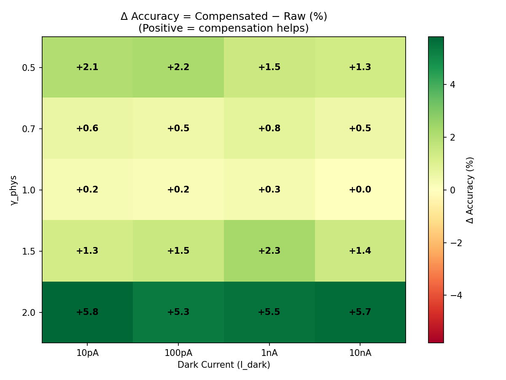
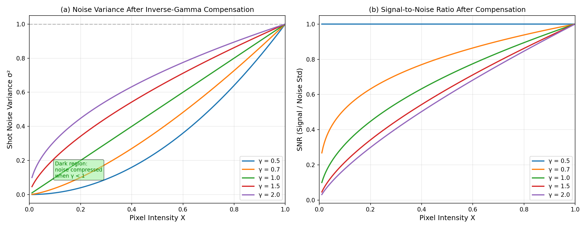
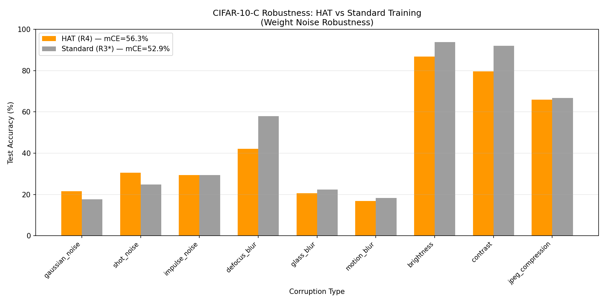

# A2.3: Front-end Physical Compensation Experiments

## Group 1: Inverse Gamma Compensation Effect

Model: HAT-trained ResNet-18 (R4)

| γ_phys | I_dark | Compensated | Raw | Δ |
|:------:|:------:|:-----------:|:---:|:---:|
| 0.5 | 10pA | 89.79% | 87.71% | +2.08% |
| 0.5 | 100pA | 89.78% | 87.60% | +2.18% |
| 0.5 | 1nA | 89.17% | 87.69% | +1.48% |
| 0.5 | 10nA | 89.21% | 87.87% | +1.34% |
| 0.7 | 10pA | 89.51% | 88.90% | +0.61% |
| 0.7 | 100pA | 89.72% | 89.24% | +0.48% |
| 0.7 | 1nA | 89.92% | 89.11% | +0.81% |
| 0.7 | 10nA | 89.68% | 89.17% | +0.51% |
| 1.0 | 10pA | 89.84% | 89.61% | +0.23% |
| 1.0 | 100pA | 89.61% | 89.46% | +0.15% |
| 1.0 | 1nA | 90.00% | 89.70% | +0.30% |
| 1.0 | 10nA | 89.71% | 89.67% | +0.04% |
| 1.5 | 10pA | 89.56% | 88.28% | +1.28% |
| 1.5 | 100pA | 89.57% | 88.06% | +1.51% |
| 1.5 | 1nA | 89.89% | 87.58% | +2.31% |
| 1.5 | 10nA | 89.64% | 88.21% | +1.43% |
| 2.0 | 10pA | 89.85% | 84.04% | +5.81% |
| 2.0 | 100pA | 89.61% | 84.29% | +5.32% |
| 2.0 | 1nA | 89.99% | 84.47% | +5.52% |
| 2.0 | 10nA | 89.87% | 84.22% | +5.65% |

## Group 2: SNR vs Pixel Intensity

Key finding: For γ < 1, noise variance is amplified for **all** pixel intensities (1/γ > 1). Dark-region 'compression' is a relative effect compared to the signal increase, not absolute variance reduction.

## Group 3: CIFAR-10-C Robustness

HAT mCE: 56.28%, Standard mCE: 52.94%

