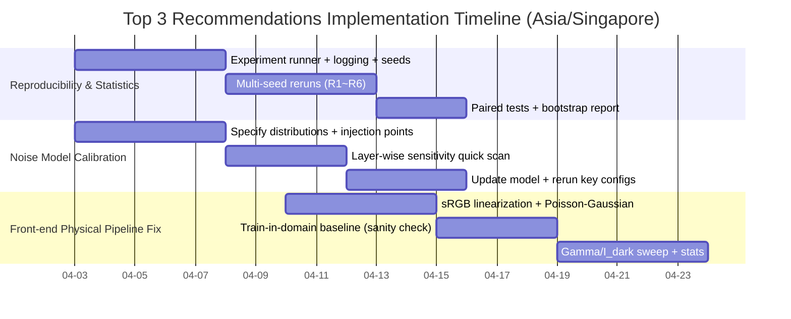

# Claude方案与A2.1实验深度审计报告

## 执行摘要

本次审计覆盖两类材料：其一是“Claude方案”相关文档（包含在 entity["organization","Google Drive","cloud storage service"] 中检索并实际读取到的两份方案稿，以及用户提供的本地 Markdown 文档体系）；其二是已完成的 A2.1 实验（ResNet-18 全链路闭环）产物（实验汇总表与训练日志）。在外部对标方面，重点对齐了：sRGB/颜色空间线性化、成像噪声建模、Processing-/Compute-in-Memory（PIM/CIM）仿真框架与量化/硬件感知训练方法论，并补充了有机器件论文与可公开获取的标准/资源。citeturn3search0turn4search45turn11search1turn7search1turn5search0turn0search9turn1search0turn15search0turn15search2turn10search49

核心结论有三点：

A2.1 的“主结果”非常清晰：**在 4-bit（16-level）量化 + 设备噪声（C2C=5%，D2D=10%）条件下，标准训练的模型在噪声推理时几乎失效（≈17%），而硬件感知训练（HAT）可将准确率恢复到 ≈90%**；这强烈支持“训练需感知硬件非理想性”这一论断，是论文/答辩最有说服力的数据支柱之一。citeturn0search9turn1search0turn5search0

但与此同时，前端物理链路目前存在“结构性风险”：你提供的物理噪声注入扫参结果显示“clean baseline”准确率为 10%（接近 CIFAR-10 随机猜测极限），且“compensated/raw”几乎无差别。这意味着：要么（i）该实验使用了未训练或不匹配的模型/权重；要么（ii）物理预处理把信息几乎全部抹掉；要么（iii）评测/标签/数据通路存在 bug。若不先把前端链路测到“合理的可用准确率区间”，前端物理补偿（反伽马、PhotocurrentSim、噪声模型）的叙事会很脆弱。citeturn3search0turn4search0turn4search45

研究方法学层面，A2.1 当前最主要短板并非“缺实验组”，而是**统计与可复现性**：目前 Monte Carlo 仅覆盖噪声推理随机性（对同一训练权重做多次噪声采样），却缺少训练随机性（多 seed）与严格的显著性检验（例如成对比较的 McNemar / paired bootstrap）。这会使很多“<1% 的改进”在审稿或答辩追问时变得被动。citeturn11search1turn0search9

优先级最高的三项改进建议为：  
（1）建立多 seed + 统一 MC + 显著性检验与日志版本化的一键复现实验框架；  
（2）将 C2C/D2D/保持时间衰减/ADC 量化等“百分比噪声”校准为可解释且可与器件数据对齐的统计模型（分布形态、相关性、层间差异）；  
（3）重做前端物理预处理评测：按标准 sRGB 线性化（而非简单 γ=2.2 幂律近似）、采用 Poisson-Gaussian 噪声并与成像标准（EMVA1288）术语对齐，确保“训练域=评测域”且准确率显著高于 chance 后再谈补偿收益。citeturn3search0turn4search0turn4search45turn11search1

## 研究对象与资料来源

本报告对“Claude方案”的解释是：以 Claude/LLM 辅助整理形成的一套“从前端光子/噪声模型 → 视网膜/采样 → 有机阵列映射与能效评估 → 训练与鲁棒性验证 → 论文叙事定位”的全栈方案文档集合；其核心在于把“有机光电器件物理”与“端到端网络训练/推理”以可验证的实验矩阵闭环起来。

已实际读取的 entity["organization","Google Drive","cloud storage service"] 内文档（通过 connector 获取全文）包括：  
- 《仿生有机神经形态视觉系统汇报》（逐页口语化汇报稿，明确“三根支柱”：物理反演、视网膜采样、并行物理计算，并声称 ResNet-18 在 CIFAR-10 上可达“90% 左右”）。  
- 《CIFAR-10 图像转为光子矩阵》（给出 sRGB 反伽马、Bayer 重采样、泊松散粒噪声注入的推导与代码模板，并建议以“数学模型 + 转码”为主要证据链组织论文）。

在 Drive 侧检索（“Claude”“A2.1”“ResNet-18”等关键词）未找到明确与 A2.1 实验直接对应的日志/报告文件，因此 A2.1 细节审计主要依赖用户提供的本地文件（/mnt/data）：

- `claude-report.md`：实验执行总计划（包含 A2.1 矩阵定义、HAT 原则、以及对“反伽马鲁棒性叙事”的修正意见）。  
- `claude全栈参考手册.md`：架构映射规则、交叉阵列约束、器件参数三档场景、ADC/DAC、能效模型与常数表、创新定位。  
- `参考文献库.md`：按用途整理的参考文献清单（约 50 条）。  
- A2.1：`resnet18_experiment_report.md` + `train_resnet18_full_20260403_095144.log`（训练日志文件名显示实验在 2026-04-03 执行）。  
- 相关但未完成/疑似异常：`convnext_experiment_report.md`（A2.2 仅有 C1），`physical_noise_report.md`（前端物理扫参准确率接近 chance），`array_mapping_report.md`（Tiny-ViT-5M 层映射与阵列需求表）。

外部对标资料获取原则：优先标准/官方/一手论文或官方仓库；能用中文来源时优先中文（例如 EMVA1288 中文译本）。citeturn11search1turn3search0turn4search45turn5search0turn7search9turn15search0

## Claude方案的理论基础对标

Claude方案的“理论栈”可以拆成三层：前端成像物理（数据生成/预处理）、中间 CIM 计算模型（映射与非理想性）、后端训练与评测（QAT/HAT、鲁棒性与能效证据）。下面逐项对标关键参考与标准，并指出与当前实现最相关的“硬约束”。

前端图像线性化与噪声：从 sRGB 到“线性光子/电流域”这一段，最容易出现“看起来合理、但物理上不严谨”的问题。标准 sRGB 的线性化（从 gamma-encoded 到 linear-light）并不是单纯的幂律 γ=2.2，而是带低亮度线性段与指数段的分段函数；这在 W3C 的 CSS Color Module Level 4（2026-02-27 Candidate Recommendation Draft）中有明确给出。citeturn3search0 你在 Drive 文档中采用“γ≈2.2 的简化反伽马”对于工程近似有价值，但一旦你把它上升为“全场景鲁棒性”论点，就必须补上：分段函数、量化误差在暗部的放大效应、以及反伽马对噪声统计（尤其是信号相关噪声）的传播影响。

成像噪声建模方面，两条一手依据尤为关键：  
- EMVA1288（相机/传感器表征标准）把线性成像模型、光子噪声（shot noise）与暗噪声等参数对齐到统一测量/报表规范，并强调其模型适用前提（线性响应、特定相机类型等）。该标准不仅有 EMVA 官方 PDF，也存在由 CMVU 翻译发布的中文译本（Zenodo）。citeturn4search45turn11search1  
- Foi 等人在 IEEE TIP 2008 提出了实用的 Poissonian-Gaussian 噪声模型：将信号相关的泊松项（光子统计）与近似高斯的其他噪声（读出/电子学）合并，并显式处理 clipping 等非线性。若你要把“PhotocurrentSim + shot noise + dark current”提升为可辩护的模型，Poisson-Gaussian（而非纯 Poisson）往往更接近现实 raw 数据。citeturn4search0

中间层：CIM/PIM 仿真与非理想性张量化。你方案中多次采用“用欧姆定律/基尔霍夫定律在物理上做矩阵乘”作为直觉解释，这个大方向可以被“工具链与验证论文”支撑得更硬：  
- DNN+NeuroSim（以及底层 NeuroSim）提供从器件/电路到算法的层级仿真，并强调对非理想性（非线性、非对称、D2D/C2C 变异、ADC 量化损失等）的建模；其训练型框架在 entity["company","GitHub","code hosting platform"] 有公开版本，且 NeuroSim 有与真实 CIM macro 进行校准验证的论文（Frontiers in AI 2021）。citeturn7search9turn5search0  
- MemTorch 作为另一条开源路线，强调与 PyTorch 的集成、非理想性共仿真与外设建模（Neurocomputing 2022）。citeturn7search4  
对你而言，关键不在“引用谁”，而在于把你当前的 C2C/D2D/ADC 等抽象参数，明确映射到：权重映射（差分对/单端）、层级阵列分块方式、读写过程与噪声注入位置（训练前向、训练更新、推理前向）这些“可复现的实现细节”。

后端：量化、STE 与硬件感知训练（HAT/QAT）。A2.1 实验的主结果与经典量化训练范式高度一致：  
- Jacob 等（CVPR 2018）系统阐述了“量化与训练协同设计”，是 QAT 重要里程碑之一。citeturn0search9  
- STE 的常用理论来源可追溯到 Bengio 等对非光滑/随机神经元梯度估计的讨论（arXiv:1308.3432）。citeturn1search0  
因此，A2.1 的“R3 崩溃、R4 恢复”在方法论上是可被外部论文传统理解的。但要把它写成“硬证据”，你还需要把统计与复现补齐（见后续建议）。

器件与系统侧一手文献：你整理的参考库中提到的若干器件指标（非线性 NL、动态范围、可辨识导通态数、衰减/保持时间等）可以在公开论文中部分印证：  
- NIR OPECT 阵列工作报告了“超低非线性（NL≈-0.015）与宽动态范围（Gmax/Gmin≈47.3）”，并展示了视觉系统应用链路。citeturn15search0  
- LATP 电解质层厚度对权重更新非线性（αd）与识别精度的影响，在 ACS AMI 2023 有明确数值（20nm αd=-6.59；100nm αd=-2.22）。citeturn15search2  
- OEGST 通过离子浓度调控实现 14-bit 可调态（并报告 MNIST/CIFAR-10 等任务准确率区间），至少从“可多态存储”角度支撑你用多 level 量化映射器件的合理性。citeturn15search1  
- 早期“用有机 memristive synapse 物理实现监督学习系统”的工作（Scientific Reports 2016）对“差分对、变异性容忍、学习规则适配”等叙事非常契合你方案中 HAT/鲁棒性的思想模板。citeturn14search0  
这些外部证据的作用是：把你方案中的“参数三档场景/噪声注入假设”与现实器件研究对齐，避免被质疑为“拍脑袋的百分比噪声”。

能效建模：你手册中引用的 Horowitz 2014 能耗表（45nm 各类算术/存储访问 pJ 级开销）仍是学界常用的一阶估算锚点，可用于把“存算分离的数据搬运昂贵”讲清楚。citeturn10search49 但要注意：这类表是工艺节点/电压/工作负载敏感的，一定要在写作中承认这是“量级级别的启发式估算”，并用仿真工具（如 DNN+NeuroSim 的 breakdown）或你自己的后仿真数据做校准。citeturn5search0turn7search1

## A2.1实验审计与结果解读

A2.1 目标是用 ResNet-18 跑通“量化 + 噪声 + 模拟 MAC/ADC + 推理”的闭环。你在总计划中定义了 6 组配置（R1~R6），并明确了关键对比链条（R1 vs R2、R2 vs R3、R3 vs R4 等）。实际产物（实验汇总表 + 训练日志）与该矩阵是一致的：R1 是纯 FP32 数字基线（Analog layers: 0），R2~R6 为 4-bit/6-bit 量化并启用 21 个“analog layers”，并在不同噪声水平与训练方式下比较。citeturn0search9turn5search0

A2.1 的汇总结果如下（来自你提供的 `resnet18_experiment_report.md`）：

| Exp | 量化 | C2C | D2D | 训练 | Best Acc | MC Mean±Std |
|---:|:---:|:---:|:---:|:---:|---:|---:|
| R1 | FP32 | 0 | 0 | Standard | 95.46% | 95.46±0.00% |
| R2 | 16L | 0 | 0 | Standard | 94.12% | 94.12±0.00% |
| R3 | 16L | 5% | 10% | Standard | 16.48% | 17.30±0.26% |
| R4 | 16L | 5% | 10% | HAT | 90.37% | 89.92±0.11% |
| R5 | 16L | 10% | 20% | HAT | 77.92% | 76.50±0.80% |
| R6 | 64L | 5% | 10% | HAT | 91.20% | 90.90±0.19% |

### 结果的因果解读

量化本身损失是温和的：R1→R2 仅 -1.34%（Best Acc）。这与 QAT 文献中“低比特量化如果做对，准确率下降有限”的经验一致。citeturn0search9

噪声是主要杀伤项：R2→R3 在相同 4-bit 量化下引入 C2C=5%、D2D=10% 后，Best Acc 暴跌 -77.64%。在训练日志中，R3 的训练准确率可爬升到接近 100%，但测试准确率几乎锁死在≈10%，呈现典型的“训练域（无硬件噪声）与推理域（有硬件噪声）不一致”现象。这是硬件部署最常见的失败模式之一：模型在“理想权重/算子”下学习到了可分性，但在“随机扰动后的等效算子”下决策边界彻底失真。citeturn5search0turn7search1

HAT 的恢复幅度巨大：R3→R4 回升 +73.89%，达到 ≈90% 区间，并且 Monte Carlo 方差很小（0.11%）。这说明：在你当前的噪声强度与分布假设下，**“训练时注入噪声/量化 + 固定 D2D + STE”** 这一组合足以把模型推回可用区间；这与 DNN+NeuroSim 等框架强调的“把器件非理想性纳入训练循环”的方向一致。citeturn5search0turn7search9turn1search0

“悲观噪声”仍有生存但损失明显：R4→R5（C2C 10%、D2D 20%）下降 12.45%，而 MC 标准差增大到 0.80%，提示在更强噪声下推理波动显著上升，可能需要更多结构性缓解手段（例如更高位宽、冗余读、多次采样/投票、层间敏感性自适应、或更强的噪声鲁棒训练策略）。citeturn5search0turn13view0

增加位宽收益有限但可能真实：R4→R6（6-bit、同噪声）提升 0.83%。在 CIFAR-10 测试集 10,000 张样本的情况下，按二项分布近似，90% 附近准确率的 95% 置信区间半宽约 0.55%~0.58%。因此 0.83% 的差值**可能**达到统计显著，但这需要严谨的成对显著性检验（同一测试集上两模型逐样本对比的 McNemar 或 paired bootstrap），并且要纳入训练随机性（多 seed）。citeturn1search7

### 数据完整性与统计性评估

当前 A2.1 数据在“配置覆盖”上是完整的：6 组对照闭环齐全、训练曲线可追踪、噪声推理的 Monte Carlo 均值/方差（至少对 R3~R6）已提供。这足以支撑“现象级对比”（R3 崩溃 vs R4 恢复）。

但在“统计可辩护性”上仍不够：  
- 缺少多训练种子（seed）重复：目前的 MC 是对固定权重的噪声采样，而不是对训练过程随机性（数据增强顺序、初始化、dropout、CUDA 非确定性等）的采样。对审稿人/答辩委员而言，“只跑一次训练”很难排除偶然性。  
- 缺少严格显著性检验与置信区间：你现在给出的是 mean±std，但它描述的是噪声采样方差，而非模型间差异是否显著。对关键对比（R4 vs R2、R4 vs R6 等），建议给出成对检验与置信区间。citeturn11search1turn0search9

## 有效性威胁与方法学问题

这一部分把“你已经做出的结果”与“你尚未控制/尚未完成的风险项”严格分开，便于你后续在论文中以“威胁-缓解”结构写得更硬。

内部有效性：实现与评估口径一致性

A2.1 的 R3 现象本身并不矛盾（训练在理想域，测试在噪声域），但它暴露出一个写作与工程的关键点：**必须明确说明噪声注入发生在何处**（训练前向、反传、权重更新、推理前向）、D2D 如何采样并在训练中固定，以及 ADC 量化是在阵列输出还是在后处理中生效。DNN+NeuroSim 的论文和仓库之所以容易被审稿人接受，很大程度来自这类建模位置被写得非常清楚。citeturn7search1turn7search9turn5search0

构念有效性：sRGB→物理域的“真实性”问题

你在 Drive 文档中把 CIFAR-10 视为“给人看的 sRGB 美化图”，并提出逆 ISP（反伽马、Bayer、shot noise）去“还原真实世界的丑信号”。这个叙事方向是合理的，但必须承认两点：

其一，标准 sRGB 的线性化应使用分段函数，而不是单一幂律；否则在暗部的线性化与量化误差会失真。citeturn3search0

其二，真实传感器 raw 噪声通常更接近 Poisson-Gaussian（shot noise + read noise），而非单纯 Poisson；并且二者参数需要由器件/相机表征确定。EMVA1288 提供了测量与报告语言，这意味着你完全可以把“PhotocurrentSim”的参数拟合与 EMVA 的术语对齐，显著提升可信度。citeturn4search0turn4search45turn11search1

外部有效性：从 ResNet-18 到最终目标网络/映射的迁移

总计划中的叙事修正（从“大模型瓶颈”转到“边缘视觉推理”）是正确的，但仍需警惕“验证对象尺度”问题：ResNet-18 是很好用的闭环试金石，但你后续主线要落在 Tiny-ViT/ConvNeXt 等与映射策略更紧耦合的结构上，否则可能在 A2.1 得到“噪声/HAT 可行”的结论，却在目标网络上因层类型（DWConv、Attention、不同张量形状）出现新的噪声敏感性。对这一点，BWQ/EPIM 等 PIM 领域工作提醒我们：算法-架构共设计算法往往需要“算子级别”而非“整网级别”的混合精度/映射策略。citeturn13view0turn13view1

红旗问题：前端物理链路目前的准确率处于 chance 附近

`physical_noise_report.md` 显示 clean baseline 10%，并且 compensated/raw 在若干 γ_phys、I_dark 条件下几乎都在 10.00%~10.01%。如果 CIFAR-10 为 10 类分类任务，10% 基本等同随机猜测。与 “A2.1 可达≈90%”并列存在时，审稿人最容易提出的质疑是：“你所谓的物理预处理是否把信息毁掉了？或者你并未在该物理域上训练模型？”

这不仅影响前端章节，也会连带影响你在 Drive 汇报稿中对“反伽马 + shot noise + 光谱响应”的可信叙事。因此，在继续做后续大实验前，建议把这条链路当作 P0 级 debugging 任务（见下一节的方案）。citeturn3search0turn4search0

## 改进建议与后续实验路线

本节给出具体、可执行、可复现的改进方案。每条建议都包含：优先级、实验协议、样本量/重复次数估计、统计检验、成功标准、风险收益与资源估计。

### 优先改进清单

下表先给出“当前设置 vs 推荐改动”的对比，帮助你快速对齐“要改什么”。

| 维度 | 当前设置（基于现有产物） | 推荐改动 | 目的与预期收益 |
|---|---|---|---|
| 训练重复（seed） | 每个配置疑似单次训练 | 每配置 ≥5 seeds（R1~R6） | 给出“均值±训练方差”，避免偶然性；支撑 <1% 改进的可信度 |
| 推理 MC | 仅对噪声配置给出 MC；R1/R2 为 0 | 全配置统一 MC：噪声配置≥30 draws；无噪声配置可设 draws=1 | 统一报告口径；把“噪声不确定性”与“训练不确定性”分离 |
| 显著性检验 | 无成对显著性检验 | 对关键对比做 McNemar（同测试集逐样本对比）+ paired bootstrap CI | 回答“差 0.8% 是否显著”的审稿追问 |
| 前端物理预处理 | 物理噪声扫参准确率≈10% | 先做“训练域=物理域”的基线训练；用标准 sRGB 线性化 + Poisson-Gaussian 噪声 | 先把链路跑到“>70~80%”再谈补偿收益，消除红旗风险 |
| 噪声模型参数 | C2C/D2D 用百分比抽象；分布形态/相关性不明确 | 以器件数据校准：D2D 用对数正态/截断高斯；C2C 用更新噪声/读噪声分离；层间可异质 | 从“拍脑袋噪声”变成“可映射到器件统计”的模型 |
| 鲁棒性指标 | 主要是 clean accuracy；未系统报告 corruption 指标 | 引入 CIFAR-10-C 的 mCE（或 Top-1 across severities）并明确其定位：测试加噪训练的鲁棒性，而非前端补偿 | 分离两类鲁棒性贡献，避免叙事混淆 |
| 能效证据链 | 手册中有 Horowitz 常数；但未见当前实验的能耗/面积数字 | 用 DNN+NeuroSim breakdown 或自建能耗分解表，将 A2.* 的“精度-能效”写成 trade-off 曲线 | 让“存算一体更能效”从口号变成量化证据 |

### 建议一：建立可复现与统计严谨的一键实验框架

优先级：P0（立刻做）

实验协议（建议固化为 `run_experiments.py` + `config.yaml`）：  
- 固定数据集版本与下载源；记录数据哈希（至少记录 CIFAR-10 官方 split）。citeturn1search7  
- 每个配置（R1~R6）训练 5 个 seeds（建议 0~4），并开启 deterministic 选项或至少记录非确定性开关；保存每个 seed 的 best checkpoint 与最终 checkpoint。  
- 推理 MC：对含噪声配置（R3~R6）每个 seed 做 30 次噪声采样推理（draws=30），报告：  
  - per-seed mean±std（噪声方差）  
  - across-seed mean±std（训练方差）  
  - overall mean 的 95% CI（bootstrap）

统计检验与报告：  
- 对关键对比（R2 vs R4、R4 vs R6、R4 vs R5），在同一测试集上做 McNemar 检验；并用 paired bootstrap 给出 Δaccuracy 的 95% CI。  
- 若你后续引入 CIFAR-10-C，则对各 corruption 的 accuracy 做分层汇总，并报告平均指标（如 mCE 或平均 error）。citeturn1search7

样本量/重复次数估计：  
- seed=5 足以给出训练方差的粗稳健估计（若方差>0.5%，可加到 10）。  
- MC draws=30 对于你当前观测到的 0.1%~0.8% std，能够把均值估计误差（SEM）压到 ~0.02%~0.15%。  

成功标准：  
- 每个配置给出“训练方差”和“噪声方差”两条误差线；关键结论（R3 崩溃、R4 恢复）在 5 seeds 下保持方向一致。  

风险/收益与资源：  
- 收益：立刻把 A2.1 主结论从“单次跑出来的漂亮结果”升级为“可复现的统计结论”，对所有后续章节都是乘数效应。  
- 风险：主要是计算开销上升。  
- 资源估计（基于你日志中单次 200 epoch 约半小时量级）：6 配置 × 5 seeds ≈ 30 次训练；若单次 35 分钟，则约 17.5 GPU 小时；加上推理 MC 开销，通常在 20 GPU 小时内可完成（单卡约 1 天）。人员：1 名工程/研究人员 2~3 天可搭好框架并产出首轮报告。

### 建议二：把 C2C/D2D/ADC/保持时间“校准”为可解释的统计模型

优先级：P0（与建议一并行）

核心思想：把“百分比噪声”变成“可被器件论文/实测表征支撑的分布假设”，并明确各噪声来自哪里：  
- D2D：器件间静态偏置（如导通态分布、增益偏差、阈值偏移）。  
- C2C：写入/更新噪声、读噪声或瞬时扰动（可能与 signal-dependent 噪声相关）。  
- ADC：量化噪声（可用均匀量化误差模型，或在 NeuroSim/DNN+NeuroSim 中用现成 ADC 模块）。citeturn5search0  
- 保持时间衰减：权重漂移（可用指数或幂律衰减，参数需与器件工作对齐；你的手册已有“保持/衰减”条目，但需要与外部论文相互印证）。citeturn15search0turn15search1turn15search2

实验协议：  
1) 分布形态确定：  
- 默认建议从“截断对数正态（D2D）+ 零均值高斯（读噪声）+ 写入噪声（与电导态相关）”起步。  
- 对比“高斯 vs 对数正态 vs 分段线性”三种候选，用信息准则（AIC/BIC）或简单的 QQ plot/KS 检验选型。  

2) 参数校准：  
- 若你已有器件实测：至少 N_devices≥30（更好 100）估计 D2D；每器件 N_pulses≥100 估计 C2C。  
- 若尚无实测：用公开器件论文做“先验范围”并明确“此为文献先验，待 B 线实测替换”。例如：OPECT 的 NL 与动态范围报告可作为“低非线性档”；LATP 厚度数据可作为“非线性可调档”。citeturn15search0turn15search2  

3) 层间异质性（强烈建议）：  
- 不同层对噪声敏感性差异很大（尤其早期特征层 vs 后期分类头）。建议允许每层独立噪声幅度（从同一分布族采样，但参数可缩放），并做敏感性排序（见建议四）。citeturn5search0turn13view0

样本量估计：  
- 设备统计：N_devices≥30 给出均值/方差的稳定估计；若需要分层（不同工艺条件、不同厚度等），每层建议≥30。  
- 若用文献先验：至少 3 篇不同来源器件论文给出区间，避免单篇过拟合（你已具备良好的参考库，但要在 web 可核查的论文上“落锚”）。citeturn15search0turn15search1turn15search2turn14search2turn14search0

成功标准：  
- 噪声模型的每个参数都能回答“它对应物理上什么？”以及“来自哪篇论文/哪组实测？”  
- 在校准后，R4/R5 的“生存曲线”随噪声增强呈现单调可解释趋势，且不同层敏感性排序稳定。

风险/收益与资源：  
- 收益：这是把“硬件非理想性”从概念变为可辩护模型的关键；并能直接导出论文中的“器件指标需求”（例如：需要把 NL 控制在某范围、保持时间达到某量级、ADC 至少多少位等）。citeturn15search0turn5search0  
- 风险：若实测数据量不足，参数可能过拟合；需在报告中清楚标注“文献先验 vs 实测校准”。  
- 资源：无实测时主要是建模与跑 ablation（1 人 3~5 天 + 若干 GPU 小时）；有实测时需实验同学配合（1~2 周采样 + 2~3 天拟合）。

### 建议三：重做前端物理预处理实验，使其先达到“可用准确率”，再讨论补偿收益

优先级：P0（当前最大红旗）

为什么必须先做：成像线性化与噪声注入如果让系统准确率接近 10%，那么任何“补偿有用/无用”的结论都不可信，因为系统已处于“信息几乎丢失”的退化态。

建议的“最小可辩护”实验协议：

阶段一：把“训练域=物理域”的上限跑出来  
- 数据生成：  
  - sRGB→linear-light：采用 W3C 标准分段函数，而非仅 γ=2.2。citeturn3search0  
  - 噪声：采用 Poisson-Gaussian（shot + read/dark），参数可先从合理范围取默认值，再在阶段二扫参；参考 Foi 2008。citeturn4search0  
  - 若要用 EMVA1288 术语，明确：量子效率、系统增益、暗噪声方差等，并在附录中写清你如何把这些映射到仿真参数。citeturn4search45turn11search1  
- 训练：用同一物理变换生成的训练集训练一个简单 CNN/ResNet-18（先不加权重噪声），在同一变换生成的测试集评测。  
- 成功标准（建议）：Top-1 ≥70%（保守门槛；理想情况下应接近无变换训练的 90%+，但取决于你引入的 CFA/降采样是否过强）。  

阶段二：再讨论“补偿是否有用”  
- 在阶段一达到可用准确率后，再对比 compensated vs raw：  
  - 固定模型（同一训练策略），扫 γ_phys 与 I_dark（你总计划中已有矩阵），每条件下做 MC draws≥10。  
  - 统计：把 Δaccuracy（comp − raw）作为响应变量，用两因素方差分析或线性模型分解 γ_phys 与 I_dark 的主效应与交互项；同时报告每点的置信区间。citeturn4search0  

样本量/计算量估计：  
- 扫参矩阵示例：γ_phys 5 档 × I_dark 4 档 × shot(on/off) 2 档 = 40 条件；每条件推理 MC=10，共 400 次推理（对 CIFAR-10 10k 测试集，GPU 上通常可控）。训练只对关键条件做 3 seeds（不需要 40 条件都训练），否则计算爆炸。  

成功标准（建议写成“可发表的结论”）：  
- “补偿有效”不应只看平均提升，而应看在某些物理区间（例如低光子通量/高 I_dark）是否显著改善，并且与噪声模型传播方向一致。  
- 若补偿总体无提升，也应能解释为：“噪声主导项在此区间由 read/dark 或量化主导，gamma 补偿无法改善 SNR”，并与 Poisson-Gaussian/EMVA 的噪声分解一致。citeturn4search0turn4search45  

风险/收益与资源：  
- 收益：一旦阶段一把准确率拉出 chance，你的“从光子到计算的全链路”叙事就能站住，并且后续所有“是否鲁棒”讨论才有意义。  
- 风险：可能发现“反伽马补偿对总体精度帮助不大”，这并非坏事，但需要你提前准备“负结果也可发表”的解释路径（例如把贡献定位到“建立可校准的物理噪声数据生成管线”而非“补偿必然提升精度”）。  
- 资源：1 人 3~7 天（主要是把数据管线写成可训练 DataLoader + 跑通 baseline）；计算量取决于训练次数（建议先 1~2 个条件跑通再扩展）。

### 建议四：补齐鲁棒性与能效证据链，使论文“更像硬件论文”

优先级：P1（在 P0 稳定后做）

鲁棒性：  
- 将 CIFAR-10-C 明确定位为“权重噪声/HAT 的鲁棒性测试”，不要再把它作为“前端光学补偿鲁棒性”证据（你总计划中已提出这一修正方向）。  
- 指标建议：除了 Top-1，至少给出 corruption 维度上的平均 error（或 mCE），并在图注中说明对齐方式。citeturn1search7  

能效：  
- 把 Horowitz 作为量级锚点，但最终应落到“你方案的 breakdown”。citeturn10search49  
- 若你使用 DNN+NeuroSim/NeuroSim：输出面积/能耗/延迟分解表，至少展示 ADC、阵列、累加、buffer/interconnect 的占比；NeuroSim 验证论文提供了这类 breakdown 的组织方式。citeturn5search0turn7search1

成功标准：  
- 能答复“精度下降 X%，能效提升 Y 倍”且 Y 的来源可追溯到 breakdown。  

风险/资源：  
- 最大风险是你会发现 ADC/外设能耗占比过大，导致“阵列 O(1) MAC”优势被系统瓶颈抵消；但这反而能引导你提出更有价值的后续工作（如更低位 ADC、混合精度、复用策略）。citeturn13view0turn5search0  
- 资源：若已有工具链，1 人 3~5 天可整理出可发表的能效结果；否则用简化模型也可先给“趋势图”。

### 建议五：把验证向目标网络与映射策略推进，避免“试金石停在 ResNet-18”

优先级：P2（在 P0/P1 完成后）

你已有 Tiny-ViT-5M 的层级映射与阵列需求表，这是很好的起点：下一步建议选取“确实映射到模拟阵列的关键层”做层级 ablation（逐层或逐 stage 注入噪声），输出“噪声敏感性热力图”，并据此做混合精度/映射策略（例如参考 BWQ 的 block-wise 思维）。citeturn13view0

成功标准：  
- 给出“哪些层必须高精度/低噪声、哪些层可低精度”的可执行策略，并能落回器件指标（例如某类层需要 NL 更低或更多可用态）。citeturn15search0turn15search2turn15search1

风险/资源：  
- 风险在于工作量上升，但这是通往论文“硬贡献”的必经之路。  
- 资源：取决于网络规模与仿真速度；建议先做 layer-wise 推理噪声注入，不必一开始就全训练全评。

### 推荐项的风险/收益与资源汇总

| 推荐项 | 优先级 | 主要收益 | 主要风险 | 人员/时间估计 | 计算/设备估计 |
|---|---|---|---|---|---|
| 可复现+统计框架（多 seed + MC + 显著性） | P0 | 主结论可辩护、后续工作累积 | 计算开销上升 | 1 人 2~3 天 | ~20 GPU 小时/单卡 1 天 |
| 噪声/器件参数校准（分布、层异质、保持衰减） | P0 | 从“百分比噪声”升级为“物理可解释模型” | 实测不足导致过拟合 | 1 人 3~5 天（无实测）/1~2 周（有实测） | 视扫参而定 |
| 前端物理预处理重做（先把 accuracy 拉出 chance） | P0 | 消除红旗，奠定“光子到计算”证据链 | 可能得到负结果（补偿无益） | 1 人 3~7 天 | 若干次训练 + 400 次推理 |
| 鲁棒性 + 能效证据链完善（CIFAR-10-C + breakdown） | P1 | 论文像硬件论文，能讲 trade-off | 发现 ADC/外设耗能占比过高 | 1 人 3~7 天 | 依赖工具链 |
| 推进到 Tiny-ViT 等目标网络的层级敏感性与策略 | P2 | 避免停在 ResNet-18，形成策略贡献 | 工作量显著增加 | 1~2 人 1~3 周 | 取决于仿真速度 |

### 顶级三项建议的实施时间线

## 来源与附件清单

### 已读取的 Drive 文档（通过 connector 获取全文）

- 仿生有机神经形态视觉系统汇报（Google Doc）  
- CIFAR-10 图像转为光子矩阵（Google Doc）

### 本次审计使用的本地文件（/mnt/data）

- `claude-report.md`  
- `claude全栈参考手册.md`  
- `参考文献库.md`  
- `resnet18_experiment_report.md`  
- `train_resnet18_full_20260403_095144.log`  
- `physical_noise_report.md`  
- `convnext_experiment_report.md`  
- `array_mapping_report.md`

### 关键外部来源（按主题列出）

sRGB/线性化：citeturn3search0  
CIFAR-10 官方数据集说明：citeturn1search7  
ResNet 原始论文（CVPR Open Access）：citeturn8search0  
QAT 代表性论文（CVPR 2018）：citeturn0search9  
STE 理论来源（arXiv:1308.3432）：citeturn1search0  
成像噪声模型（Poisson-Gaussian，TIP 2008）：citeturn4search0  
成像表征标准 EMVA1288（英文与中文译本）：citeturn4search45turn11search1  
NeuroSim 验证论文：citeturn5search0  
DNN+NeuroSim 与开源仓库：citeturn7search1turn7search9  
MemTorch（Neurocomputing 2022）：citeturn7search4  
器件论文（OPECT、LATP、OEGST 等）：citeturn15search0turn15search2turn15search1turn14search2turn14search0  
能耗锚点（Horowitz 2014）：citeturn10search49